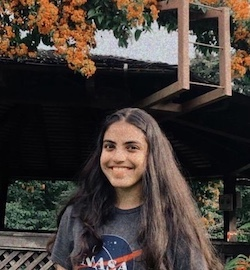
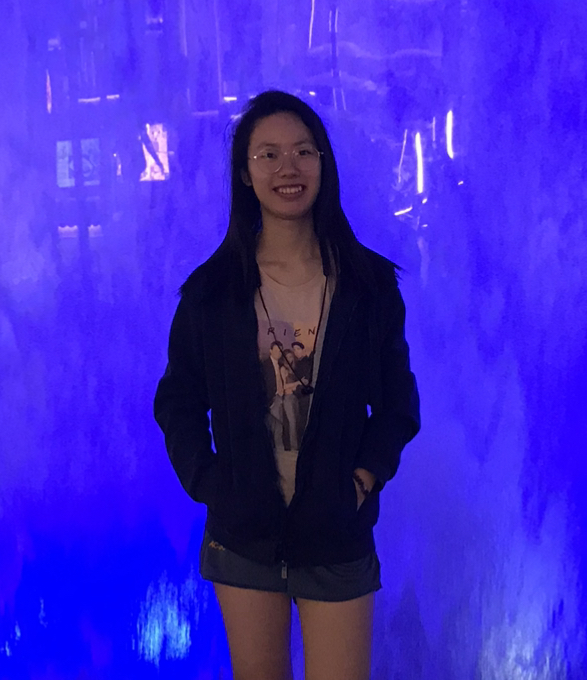

We are a team based in the [School of Computing, National University of Singapore](http://www.comp.nus.edu.sg).

## Project team

### Willy Angga Prawira

[[github](https://github.com/willyamped)]
[[portfolio](team/willyamped.md)]

* Role: Developer
* Responsibilities: UI, Logic, Tests, Documentation

### Modi Trushti Sanjaybhai

[[github](http://github.com/tsm1820)]
[[portfolio](team/tsm1820.md)]

* Role: Developer
* Responsibilities: Logic, Tests, Documentation

### Hu Tianran

[[github](http://github.com/nature711)] [[portfolio](team/nature711.md)]

* Role: Developer
* Responsibilities: UI, Logic, Tests, Documentation

### Qu Tianyue

[[github](http://github.com/tianyue58)]
[[portfolio](team/tianyue58.md)]

* Role: Developer
* Responsibilities: Logic, Tests, Documentation

### Felicia Ivane Pranoto

[[github](http://github.com/feliciaivane)]
[[portfolio](team/feliciaivane.md)]

* Role: Developer
* Responsiblities: Logic, Tests, Documentation
