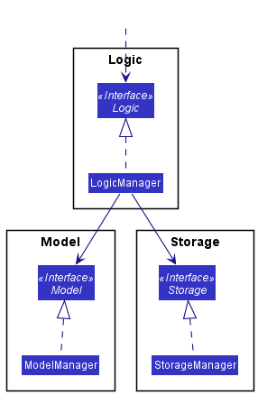
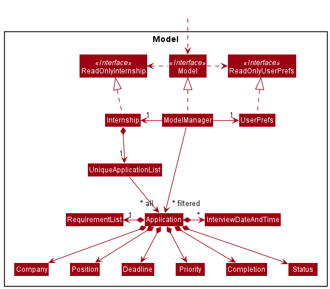
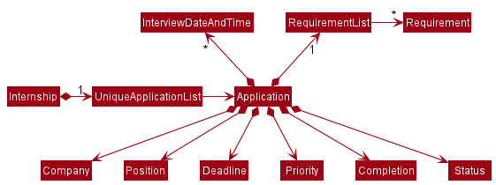
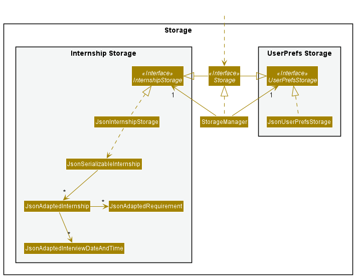
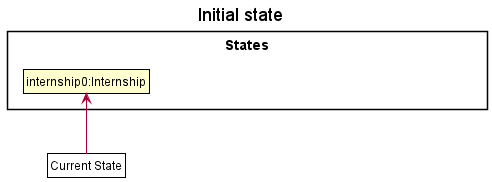
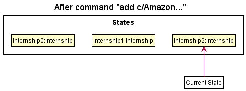
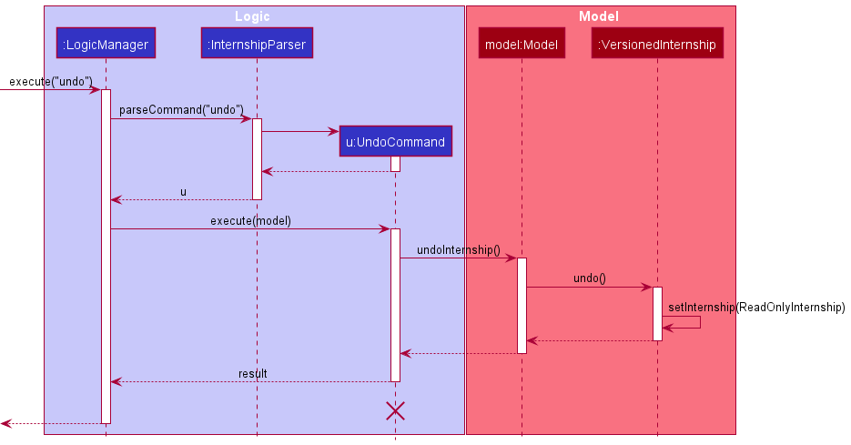
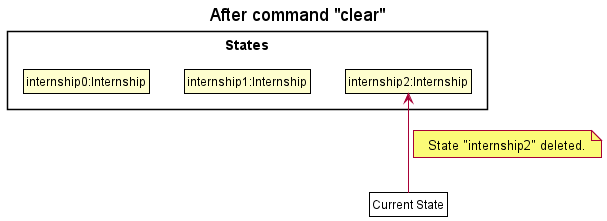
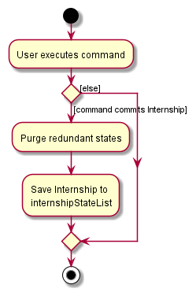

* Table of Contents
{:toc}

--------------------------------------------------------------------------------------------------------------------

## **Acknowledgements**

* While this product uses a generic application called [AddressBook-Level3 (AB3)](https://se-education.org) 
as the starting point, the idea for some advanced features, such as `undo` and `redo`, are adopted from 
[AddressBook-Level4 (AB4)](https://se-education.org/addressbook-level4).

--------------------------------------------------------------------------------------------------------------------

## **Setting up, getting started**

Refer to the guide [_Setting up and getting started_](SettingUp.md).

--------------------------------------------------------------------------------------------------------------------

## **Design**

:bulb: **Tip:** The `.puml` files used to create diagrams in this document can be found in the [diagrams](https://github.com/se-edu/addressbook-level3/tree/master/docs/diagrams/) folder. Refer to the [_PlantUML Tutorial_ at se-edu/guides](https://se-education.org/guides/tutorials/plantUml.html) to learn how to create and edit diagrams.

### Architecture

The ***Architecture Diagram*** given above explains the high-level design of the App.

Given below is a quick overview of main components and how they interact with each other.

**Main components of the architecture**

**`Main`** has two classes called [`Main`](https://github.com/se-edu/addressbook-level3/tree/master/src/main/java/seedu/address/Main.java) and [`MainApp`](https://github.com/se-edu/addressbook-level3/tree/master/src/main/java/seedu/address/MainApp.java). It is responsible for,
* At app launch: Initializes the components in the correct sequence, and connects them up with each other.
* At shut down: Shuts down the components and invokes cleanup methods where necessary.

[**`Commons`**](#common-classes) represents a collection of classes used by multiple other components.

The rest of the App consists of four components.

* [**`UI`**](#ui-component): The UI of the App.
* [**`Logic`**](#logic-component): The command executor.
* [**`Model`**](#model-component): Holds the data of the App in memory.
* [**`Storage`**](#storage-component): Reads data from, and writes data to, the hard disk.

**How the architecture components interact with each other**

The *Sequence Diagram* below shows how the components interact with each other for the scenario where the user issues the command `delete 1`.

Each of the four main components (also shown in the diagram above),

* defines its *API* in an `interface` with the same name as the Component.
* implements its functionality using a concrete `{Component Name}Manager` class (which follows the corresponding API `interface` mentioned in the previous point.

For example, the `Logic` component defines its API in the `Logic.java` interface and implements its functionality using the `LogicManager.java` class which follows the `Logic` interface. Other components interact with a given component through its interface rather than the concrete class (reason: to prevent outside component's being coupled to the implementation of a component), as illustrated in the (partial) class diagram below.

The sections below give more details of each component.

### UI component

The **API** of this component is specified in [`Ui.java`](https://github.com/se-edu/addressbook-level3/tree/master/src/main/java/seedu/address/ui/Ui.java)

The UI consists of a `MainWindow` that is made up of parts e.g.`CommandBox`, `ResultDisplay`, `ApplicationListPanel`, `StatusBarFooter` etc. All these, including the `MainWindow`, inherit from the abstract `UiPart` class which captures the commonalities between classes that represent parts of the visible GUI.

The `UI` component uses the JavaFx UI framework. The layout of these UI parts are defined in matching `.fxml` files that are in the `src/main/resources/view` folder. For example, the layout of the [`MainWindow`](https://github.com/se-edu/addressbook-level3/tree/master/src/main/java/seedu/address/ui/MainWindow.java) is specified in [`MainWindow.fxml`](https://github.com/se-edu/addressbook-level3/tree/master/src/main/resources/view/MainWindow.fxml)

The `UI` component,

* executes user commands using the `Logic` component.
* listens for changes to `Model` data so that the UI can be updated with the modified data.
* keeps a reference to the `Logic` component, because the `UI` relies on the `Logic` to execute commands.
* depends on some classes in the `Model` component, as it displays `Application` object residing in the `Model`.

### Logic component

**API** : [`Logic.java`](https://github.com/se-edu/addressbook-level3/tree/master/src/main/java/seedu/address/logic/Logic.java)

Here's a (partial) class diagram of the `Logic` component:

How the `Logic` component works:
1. When `Logic` is called upon to execute a command, it uses the `InternshipParser` class to parse the user command.
1. This results in a `Command` object (more precisely, an object of one of its subclasses e.g., `AddCommand`) which is executed by the `LogicManager`.
1. The command can communicate with the `Model` when it is executed (e.g. to add an application).
1. The result of the command execution is encapsulated as a `CommandResult` object which is returned back from `Logic`.

The Sequence Diagram below illustrates the interactions within the `Logic` component for the `execute("delete 1")` API call.

:information_source: **Note:** The lifeline for `DeleteCommandParser` should end at the destroy marker (X) but due to a limitation of PlantUML, the lifeline reaches the end of diagram.

Here are the other classes in `Logic` (omitted from the class diagram above) that are used for parsing a user command:

How the parsing works:
* When called upon to parse a user command, the `InternshipParser` class creates an `XYZCommandParser` (`XYZ` is a placeholder for the specific command name e.g., `AddCommandParser`) which uses the other classes shown above to parse the user command and create a `XYZCommand` object (e.g., `AddCommand`) which the `InternshipParser` returns back as a `Command` object.
* All `XYZCommandParser` classes (e.g., `AddCommandParser`, `DeleteCommandParser`, ...) inherit from the `Parser` interface so that they can be treated similarly where possible e.g, during testing.

### Model component
**API** : [`Model.java`](https://github.com/se-edu/addressbook-level3/tree/master/src/main/java/seedu/address/model/Model.java)

The `Model` component,

* stores the InternSHIP data i.e., all `Application` objects (which are contained in a `UniqueApplicationList` object).
* stores the currently 'selected' `Application` objects (e.g., results of a search query) as a separate _filtered_ list which is exposed to outsiders as an unmodifiable `ObservableList<Application>` that can be 'observed' e.g. the UI can be bound to this list so that the UI automatically updates when the data in the list change.
* stores a `UserPref` object that represents the user’s preferences. This is exposed to the outside as a `ReadOnlyUserPref` objects.
* does not depend on any of the other three components (as the `Model` represents data entities of the domain, they should make sense on their own without depending on other components)

:information_source: **Note:** An alternative (arguably, a more OOP) model is given below. It has a `Requirement` list in the `Internship`, which `Application` references. This allows `Internship` to only require one `Requirements` object per unique requirement, instead of each `Application` needing their own `Requirements` objects. 

### Storage component

**API** : [`Storage.java`](https://github.com/se-edu/addressbook-level3/tree/master/src/main/java/seedu/address/storage/Storage.java)

The `Storage` component,
<<<<<<< HEAD
* can save both InternSHIP data and user preference data in json format, and read them back into corresponding objects.
=======
* can save both internship data and user preference data in json format, and read them back into corresponding objects.
>>>>>>> 9e69da7bb1df9c61700bd73d1a3a2d7fe1989a02
* inherits from both `InternshipStorage` and `UserPrefStorage`, which means it can be treated as either one (if only the functionality of only one is needed).
* depends on some classes in the `Model` component (because the `Storage` component's job is to save/retrieve objects that belong to the `Model`)

### Common classes

Classes used by multiple components are in the `seedu.addressbook.commons` package.

--------------------------------------------------------------------------------------------------------------------

## **Implementation**

This section describes some noteworthy details on how certain features are implemented.

### Complete feature
The `complete` command is modelled by the `Completion` class which represents the
'Completion' entity. The `Completion` field is also added as a private attribute to the 
`Application` class. This field can take the following values:
* `Completed`
* `Uncompleted`

Note: When a new internship application is added, the value of the
`Completion` field is 'Uncompleted' by default.

The `Complete` command is facilitated by the `CompleteCommand` class. It extends the `Command` class
and implements the `CompleteCommand#execute()` method which wraps the main
logic of the command. This command can be used to change the completion status of 
the application from `Uncompleted` to `Completed`.

The `CompleteCommandParser` class is responsible for parsing the index received from the user. This 
class implements the `Parser` interface. The `CompleteCommandParser#parse()` method of 
this class parses the index and returns an `CompleteCommand` object with the index
as the parameter.

#### Design considerations:

* **Alternative 1 (current choice):** Only allow users to complete an existing application in the list
    * Pros: Easy to implement.
    * Cons: User cannot add an application that has already been completed.

* **Alternative 2:** Provide the option to specify the completion status of an application when it is first added to the list
    * Pros: Everything can be done in one shot.
    * Cons: The `add` command will require too many parameters.

### Accept feature

The `accept` command is modelled by the `Status` class which represents the 
'Status' entity. The `Status` field is also added as a private attribute to the
`Application` class. This field can take the following values:
* `Pending`
* `Accepted`
* `Rejected`

Note: When a new internship application is added, the value of the
`Status` field is 'Pending' by default. 

The Accept command is facilitated by the `AcceptCommand` class. It extends the `Command` class
and implements the `AcceptCommand#execute()` method which wraps the main
logic of the command. This command can be used to change the status of 
the application from `Pending` to `Accepted`. When the status changes, the application completion
field would change from `Uncompleted` to `Completed` automatically.

The `AcceptCommandParser` class is responsible for parsing the index received from the user. This 
class implements the `Parser` interface. The `AcceptCommandParser#parse()` method of 
this class parses the index and returns an `AcceptCommand` object with the index
as the parameter. 

#### Design considerations:

* **Alternative 1 (current choice):** The default status when an application is added is `Pending`. 
It can later be changed to `Accepted` using the `accept` command.
    * Pros: Convenient for the user to use.
    * Cons: User cannot add an application whose status is already known.

* **Alternative 2:** Provide the ability to specify the status of an application at the time of adding.
    * Pros: Easy to specify the desired status field while adding an application.
    * Cons: The `add` command will require too many parameters.

### Reject feature

The `reject` command is modelled by the `Status` class which represents the
'Status' entity. The `Status` field is also added as a private attribute to the
`Application` class. This field can take the following values:
* `Pending`
* `Accepted`
* `Rejected`

Note: When a new internship application is added, the value of the
`Status` field is 'Pending' by default.

The Reject command is facilitated by the `RejectCommand` class. It extends the `Command` class
and implements the `RejectCommand#execute()` method which wraps the main
logic of the command. This command can be used to change the status of
the application from `Pending` to `Rejected`. When the status changes, the application completion
field would change from `Uncompleted` to `Completed` automatically.

The `RejectCommandParser` class is responsible for parsing the index received from the user. This
class implements the `Parser` interface. The `RejectCommandParser#parse()` method of
this class parses the index and returns an `RejectCommand` object with the index
as the parameter.

#### Design considerations:

* **Alternative 1 (current choice):** The default status when an application is added is `Pending`.
  It can later be changed to `Rejected` using the `reject` command.
    * Pros: Convenient for the user to use.
    * Cons: User cannot add an application whose status is already known.

* **Alternative 2:** Provide the ability to specify the status of an application at the time of adding.
    * Pros: Easy to specify the desired status field while adding an application.
    * Cons: The `add` command will require too many parameters.

### Sort feature

The `Sort` command is facilitated by the `SortCommand` class. It extends the `Command` class and implements the `SortCommand#execute()` method which wraps the main logic of the command. This command can be used to sort the **currently displayed** list of applications according to the specified field.

The `SortCommandParser` class is responsible for parsing the field received from the user. This class implements the `Parser` interface. The `SortCommandParser#parse()` method of this class parses the field and returns a `SortCommand` object with the field as the parameter.

#### Design considerations:

* **Alternative 1 (current choice):** Only allow lists to be sorted in one direction per field (e.g. sooner to later for deadline, alphabetically for company name)
    * Pros: Easier to implement. The implemented direction of sorting is also the more logical one (users are unlikely to want to view their applications from lower to higher priority).
    * Cons: The user cannot specify the direction of sorting (e.g. later deadlines first)

* **Alternative 2:** Provide the option to specify the field to sort the list by as well as the direction of sorting.
    * Pros: Users have more options on how to view their list of applications.
    * Cons: The `sort` command will require more parameters.

### Find feature
The find feature is implemented by the `FindCommandParser` and `FindCommand` classes.

`FindCommandParser` class is responsible for parsing the parameter received from the user.

`FindCommand` class is responsible for finding the matching applications with specified fields according to the given syntax and keyword.

#### Design considerations:

* **Alternative 1 (current choice):** Matches applications using specified fields (e.g. user can specify deadline field with d/) and keywords.
    * Pros: User can specify fields to match similar to the way in `AddCommand` and `EditCommand`. 
    * Cons: The `find` command will require more parameters.

* **Alternative 2:** Uses different command word for finding different fields (e.g. findD for matching application with deadlines).
    * Pros: Shorter command for user to input.
    * Cons: Harder for user to remember the command word as this format is not used in other methods.

### Soon feature
The soon feature is implemented by the `SoonCommandParser` and `SoonCommand` classes.

`SoonCommandParser` class is responsible for parsing the parameter received from the user.

`SoonCommand` class is responsible for listing the applications whose submission or interview deadlines are within a certain number of days specified by the user.

#### Design considerations:

* **Alternative 1 (current choice):** Lists applications using a specified field (e.g. user can specify deadline field with d/ or interview field with i/) and number of days.
    * Pros: User can specify a number to see applications that are due within the specified number of days.
    * Cons: The `soon` command will require more parameters.

* **Alternative 2:** List applications whose deadlines are within a pre-set number of days.
    * Pros: Shorter command for user to input.
    * Cons: Does not provide flexibility to the user.
    
### Undo/Redo feature

The undo/redo mechanism is facilitated by `VersionedInternship`. It extends `Internship` with an undo/redo history, stored internally as an `internshipStateList` and `currentStatePointer`. Additionally, it implements the following operations:

* `VersionedInternship#commit()` — Saves the current internship state in its history.
* `VersionedInternship#undo()` — Restores the previous internship state from its history.
* `VersionedInternship#redo()` — Restores a previously undone internship state from its history.

These operations are exposed in the `Model` interface as `Model#commitInternship()`, `Model#undoInternship()` and `Model#redoInternship()` respectively.

Given below is an example usage scenario and how the undo/redo mechanism behaves at each step.

Step 1. The user launches the application for the first time. The `VersionedInternship` will be initialized with the initial Internship state, and the `currentStatePointer` pointing to that single Internship state.

Step 2. The user executes `delete 5` command to delete the 5th application in the Internship. The `delete` command calls `Model#commitInternship()`, causing the modified state of the Internship after the `delete 5` command executes to be saved in the `internshipStateList`, and the `currentStatePointer` is shifted to the newly inserted Internship state.

Step 3. The user executes `add c/Amazon …​` to add a new application. The `add` command also calls `Model#commitInternship()`, causing another modified Internship state to be saved into the `internshipStateList`.

:information_source: **Note:** If a command fails its execution, it will not call `Model#commitInternship()`, so the Internship state will not be saved into the `internshipStateList`.

Step 4. The user now decides that adding the application was a mistake, and decides to undo that action by executing the `undo` command. The `undo` command will call `Model#undoInternship()`, which will shift the `currentStatePointer` once to the left, pointing it to the previous Internship state, and restores the Internship to that state.

:information_source: **Note:** If the `currentStatePointer` is at index 0, pointing to the initial Internship state, then there are no previous Internship states to restore. The `undo` command uses `Model#canUndoInternship()` to check if this is the case. If so, it will return an error to the user rather
than attempting to perform the undo.

The following sequence diagram shows how the undo operation works:

:information_source: **Note:** The lifeline for `UndoCommand` should end at the destroy marker (X) but due to a limitation of PlantUML, the lifeline reaches the end of diagram.

The `redo` command does the opposite — it calls `Model#redoInternship()`, which shifts the `currentStatePointer` once to the right, pointing to the previously undone state, and restores the Internship to that state.

:information_source: **Note:** If the `currentStatePointer` is at index `internshipStateList.size() - 1`, pointing to the latest Internship state, then there are no undone Internship states to restore. The `redo` command uses `Model#canRedoInternship()` to check if this is the case. If so, it will return an error to the user rather than attempting to perform the redo.

Step 5. The user then decides to execute the command `list`. Commands that do not modify the Internship, such as `list`, `help`, `find`, will usually not call `Model#commitInternship()`, `Model#undoInternship()` or `Model#redoInternship()`. Thus, the `internshipStateList` remains unchanged.

Step 6. The user executes `clear`, which calls `Model#commitInternship()`. Since the `currentStatePointer` is not pointing at the end of the `internshipStateList`, all Internship states after the `currentStatePointer` will be purged. Reason: It no longer makes sense to redo the `add c/Amazon` command. This is the behavior that most modern desktop applications follow.

The following activity diagram summarizes what happens when a user executes a new command:

#### Design considerations:

**Aspect: How undo & redo executes:**

* **Alternative 1 (current choice):** Saves the entire Internship.
  * Pros: Easy to implement.
  * Cons: May have performance issues in terms of memory usage.

* **Alternative 2:** Individual command knows how to undo/redo by
  itself.
  * Pros: Will use less memory (e.g. for `delete`, just save the application being deleted).
  * Cons: Must ensure that the implementation of each individual command are correct.

### \[Proposed\] Data archiving

_{Explain here how the data archiving feature will be implemented}_

--------------------------------------------------------------------------------------------------------------------

## **Documentation, logging, testing, configuration, dev-ops**

* [Documentation guide](Documentation.md)
* [Testing guide](Testing.md)
* [Logging guide](Logging.md)
* [Configuration guide](Configuration.md)
* [DevOps guide](DevOps.md)

--------------------------------------------------------------------------------------------------------------------

## **Appendix 1: Requirements**

### Product scope

**Target user profile**:
Our target user is a university student who:  
* has a need to manage a significant number of internship applications
* prefer desktop apps over other types
* can type fast
* prefers typing to mouse interactions
* is reasonably comfortable using CLI apps

**Value proposition**: 
* Store all the information related to an internship application in one app.
* View applications in different ways (e.g. view applications with nearby application deadlines, find uncompleted applications only, sort by priority) to facilitate organised management of internship applications and avoid missing any deadlines.
* Manage internship applications faster than a typical mouse/GUI driven app.

### User stories

Priorities: High (must have) - `* * *`, Medium (nice to have) - `* *`, Low (unlikely to have) - `*`

| Priority | As a …​                                    | I want to …​                     | So that I can…​                                                        |
| -------- | ------------------------------------------ | ------------------------------ | ---------------------------------------------------------------------- |
| `* * *`  | student                                    | add a company I have applied  | keep track of the lists of companies I have applied                 |
| `* * *`  | student                                    | record the deadline of an application | better organize my time for preparation and complete the requirements in time                      |
| `* * *`  | student                                    | record the position I have applied for an application | remember my responsibility for each application   
| `* * *`  | student                                    | record the requirements for an application | better understand what I need to prepare in order to succeed during the application |
| `* * *`  | student                                    | record the interview time for an application | better organize my time for interview preparation |
| `* * *`  | student                                    | assign priority level to an application  | know clearly which applications I should prioritize and get started first |
| `* * *`  | student                                    | view a list of all companies I have applied and the related details for each application | have a better picture about all the companies I have applied|
| `* * *`  | student                                    | delete one of the applications in the application list | stop tracking an application that I have withdrawn from |                                               
| `* * *`  | student                                    | clear the application list in the app | get rid of all sample data when I first start using the app, or start over with a brand new empty list |
| `* * *`  | student                                    | edit the details of existing applications (e.g. company name/ applied position/ application deadline / requirement details, etc.) | rectify any mistakes I made initially, or update my entry to reflect new updates in my application |
| `* * *`  | student                                    | set an application as completed once I have submitted all the requirements | shift my attention to the other uncompleted applications |
| `* * *`  | student                                    | set the status of one of the existing applications (i.e., pending to accepted/ rejected) | update my entries to reflect the latest decision I received from the company | 
| `* * *`  | student                                    | sort the applications based on different criteria (e.g., closeness to deadline, level of priority, etc.) | view the application list displayed in different forms and prioritize the applications that appear at the top of the list |
| `* * *`  | student                                    | find the applications based on different criteria (e.g., company name contains a specified word, requirements involve a specific item, etc.)  | highlight the applications of my current interest and temporarily filtering out other unrelated ones |
| `* *`    | student                                    | undo a change I have accidentally made to the application list | restore the information that has been unintentionally rectified and not losing any important information |
| `* *`    | student                                    | redo a change I have just undone | retrieve the changes I have made previously and not having to manually redo it |

### Use cases

(For all use cases below, the **System** is `InternSHIP` and the **Actor** is the `user`, unless specified otherwise)

**Use case: Adding an application entry**

**MSS**

1. User requests to add a new internship application entry to track. User inputs the company name, role applied for and application deadline
2. Internship adds the entry to its list of entries. Application status is set as pending and application is marked as uncompleted by default
3. User requests to list all entries
4. InternSHIP shows a list of all the application entries, including the newly added entry

    Use case ends.

**Extensions**

* 1a. The user fails to specify the company name, role applied for or application deadline.

    * 1a1. InternSHIP shows an error message.

      Use case returns to step 1.

**Use case: Delete an application entry**

**MSS**

1.  User requests to list all entries
2.  InternSHIP shows a list of application entries
3.  User requests to delete a specific entry in the list
4.  InternSHIP deletes the entry

    Use case ends.

**Extensions**

* 2a. The list is empty.

  Use case ends. There is nothing to delete.

* 3a. The given index is invalid.

    * 3a1. InternSHIP shows an error message.

      Use case resumes at step 2.

**Use case: Update an application entry/ Complete an application/ Update application status**

**MSS**

1.  User requests to list all entries
2.  InternSHIP shows a list of application entries
3.  User requests to update the details of a specific entry in the list/ mark the application as completed/ update the application status from pending to accepted
4.  InternSHIP updates the entry accordingly

    Use case ends.

**Extensions**

* 2a. The list is empty.

  Use case ends. There is nothing to update.

* 3a. The given index is invalid.

    * 3a1. InternSHIP shows an error message.

      Use case resumes at step 2.

*{More to be added}*

### Non-Functional Requirements

1. InternSHIP should work on any _mainstream OS_ as long as it has Java `11` or above installed.
2. InternSHIP should be able to hold up to 1000 internship applications without a noticeable sluggishness in performance for typical usage.
3. Any user command in InternSHIP should be executed within 1 second.
4. A user with above average typing speed for regular English text (i.e. not code, not system admin commands) should be able to accomplish most of the tasks faster using commands than using the mouse.
5. Any user within the target user profile should be able to use InternSHIP with the help of our [User Guide](https://ay2122s1-cs2103t-w17-1.github.io/tp/UserGuide.html).

### Glossary

* **Mainstream OS**: Windows, Linux, Unix, macOS
* **MSS** : Main Success Scenario

--------------------------------------------------------------------------------------------------------------------

## **Appendix 2: Instructions for manual testing**

Given below are instructions to test the app manually.

:information_source: **Note:** These instructions only provide a starting point for testers to work on;
testers are expected to do more *exploratory* testing.

### Launch and shutdown

1. Initial launch

   1. Download the jar file and copy into an empty folder.

   2. Double-click the jar file.  
   Expected: Shows the GUI with a set of sample applications. The window size may not be optimum.

2. Saving window preferences

   1. Resize the window to an optimum size. Move the window to a different location. Close the window.

   2. Re-launch the app by double-clicking the jar file. 
       Expected: The most recent window size and location is retained.

3. _{ more test cases …​ }_

### Deleting an application

1. Deleting an application while all applications are being shown

   1. Prerequisites: List all applications using the `list` command. Multiple applications in the list.

   2. Test case: `delete 1` 
      Expected: First contact is deleted from the list. Details of the deleted contact shown in the status message. Timestamp in the status bar is updated.

   3. Test case: `delete 0` 
      Expected: No application is deleted. Error details shown in the status message. Status bar remains the same.

   4. Other incorrect delete commands to try: `delete`, `delete x`, `...` (where x is larger than the list size) 
      Expected: Similar to previous.

### Saving data

1. Dealing with missing/corrupted data files

   1. _{explain how to simulate a missing/corrupted file, and the expected behavior}_

