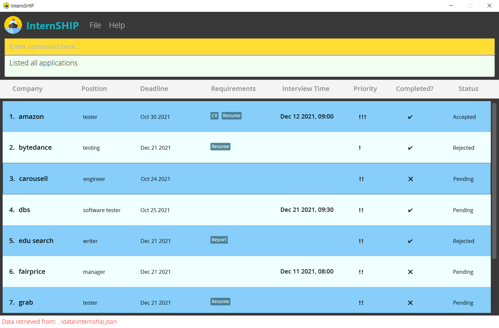

* Table of Contents
  {:toc}

## Introduction

Are you a university student looking to score a holiday internship? Do you feel overwhelmed by all the application details you have to keep track of? Have you missed any application deadlines because there are just too many to remember? Have you ever wished that there were a comprehensive app that could help you track your entire internship application process? If you answered yes to any of these questions, we have just the application for you!

InternSHIP is a **desktop app for university students to manage their internship applications.** Here are its main features:
* Tracking all essential internship application details
* Viewing specific applications
* Finding upcoming deadlines

Now you can keep track of your entire internship application process, from the application stage to the acceptance stage!

InternSHIP has been optimized for use via a Command Line Interface (CLI) while still having the benefits of a Graphical User Interface (GUI). If you can type fast, InternSHIP can get your internship management tasks done faster than traditional GUI apps.

We hope you find InternSHIP to be very useful in your internship hunt!

--------------------------------------------------------------------------------------------------------------------

## Information about this User Guide

This section aims to provide some information on the purpose as well as target audience of our User Guide.

##Purpose
This guide aims to:
* Teach first-time users how to [start using InternSHIP](#quick-start).
* Show users [how to use each command in detail](#features) should they encounter any difficulty using any of the commands in InternSHIP.
* Provide existing users with a comprehensive [summary](#command-summary) of all the commands they can use in InternSHIP.
* Provide experienced users with [tips](#tips-bulb) on how to further improve their experience using InternSHIP.
* Answer some commonly asked questions in the [FAQ](#faq) section.
* Show any interested party (e.g. other developers) the [references](#acknowledgements) used in the creation of InternSHIP.

##Target Audience
As the target audience of InternSHIP is university students, this User Guide is mainly targeted towards the same demographic. This guide is therefore aimed at users who:
* Are familiar with navigating around a webpage using hyperlinks.
* Are comfortable with downloading and installing software on their computer.
This User Guide **does not assume that the reader has a technical background**. Therefore, university students of all majors should be able to use this guide. The definitions for certain technical terms can be found in the [glossary](#glossary).

## How to use this User Guide

This section aims to explain how to properly utilise our User Guide.

NOT DONE YET 

**:information_source: Notes about the command format:** 

### Notes about the command format in [Features](#features)
* Words in `UPPER_CASE` are the [parameters](#glossary) to be supplied by the user. 
  e.g. if the User Guide states `add COMPANY_NAME`, users can input `add Shopee`, or any other company name.

* Items in square brackets are optional.  
  e.g `c/COMPANY_NAME [r/REQUIREMENT]` can be used as `c/Shopee r/CV` or as `c/Shopee`.

* Items with `…​` after them can be used multiple times including zero times.  
  e.g. `[r/REQUIREMENT]…​` can be used as `r/` (0 time), `r/CV` (1 time), `r/CV r/Resume` (2 times) etc.

* Parameters can be in any order. 
  e.g. if the command specifies `c/COMPANY_NAME p/INTERNSHIP_POSITION`, `p/INTERNSHIP_POSITION c/COMPANY_NAME`
  is also acceptable.

* For any command that takes in `INDEX` as a parameter (e.g. `edit`, `delete`, `complete`), the index refers to the index number shown in the **currently displayed application list**. It must be a **positive integer** 1, 2, 3, …​

* If a parameter is expected only once in the command but you specified it multiple times, only the last occurrence of the parameter will be taken. 
  e.g. if you specify `c/Grab c/Shopee`, only `c/Shopee` will be taken.

* For commands that do not require any parameters (such as `list` and `clear`), any parameters input by the user will be ignored. 
  e.g. `list 123` will be interpreted as just `list`.

--------------------------------------------------------------------------------------------------------------------

## Quick start

1. Ensure you have Java `11` or above installed in your Computer.

2. Download the latest `InternSHIP.jar` from [here](https://github.com/AY2122S1-CS2103T-W17-1/tp/releases).

3. Copy the file to the folder you want to use as the _home folder_ for your InternSHIP app.

4. Double-click the file to start the app. A GUI similar to the one shown below should appear in a few seconds. 
   Note how the app contains some sample data. 
   

5. Type the command in the command box and press Enter to execute it. e.g. typing **`help`** 
   and pressing Enter will open the help window. 
   Some example commands you can try:

    * **`list`** : Lists all the entries in the internship list.

    * **`add c/shopee p/software engineer d/2021-12-12`**: 
   Adds a company `shopee` with the position `software engineer` at deadline `2021-12-12` to the application list.

    * **`delete 3`** : Deletes the 3rd entry in the application list.

    * **`clear`** : Deletes all the application entries.

    * **`exit`** : Exits the app.

6. Refer to the [Features](#features) below for details of each command.

:bulb: **Tip:**

Use `clear` to erase all the sample entries from InternSHIP when they are no longer needed!

--------------------------------------------------------------------------------------------------------------------

## Features

This section shows all of InternSHIP's supported commands and how they should be used.

The commands are split in terms of InternSHIP's main features:
* [Tracking application details](#tracking-application-details)
* [Viewing specific applications](#viewing-specific-applications)
* [Finding upcoming deadlines](#finding-upcoming-deadlines)
* [Others](#others)

### Tracking application details

#### Adding an application : `add`

Adds a new entry to the application list in InternSHIP.  

Minimally, the following fields are required when a new entry is added:
- `COMPANY_NAME`
- `APPLIED_POSITION`
- `APPLICATION_DEADLINE`  

There are three fields that receive their default values.
These fields can be changed later using the `edit`, `complete` or `accept/reject` commands respectively.
- `APPLICATION_PRIORITY`: set as `Medium`  
- `COMPLETION_STATUS`  set as `Uncompleted`
- `COMPANY_DECISION` (i.e., application status) set as `Pending`

Additionally, `APPLICATION_REQUIREMENTS`, and `INTERVIEW_DATE_AND_TIME` are optional fields that can either be specified or not.
If not specified at this stage, it can still be added and edited later using the `edit` command.

:bulb: **Note:**

The `INTERVIEW_DATE_AND_TIME` and `APPLICATION_DEADLINE` fields follow a fixed input format
as follows:
- The `APPLICATION_DEADLINE` must be entered in the `YYYY-MM-DD` format where `YYYY` 
represents the four-digit year, `MM` represents the two-digit month, and `DD` represents 
the two-digit day of the month. 
- The `INTERVIEW_DATE_AND_TIME` must be entered in the `YYYY-MM-DD HHmm` format, where the date and 
time are separated by a space. For the date, `YYYY` represents the four-digit year, `MM` represents the two-digit 
month, and `dd` represents the two-digit day of the month. The time is represented in a 24-hour 
system. `HH` represents the hours and `mm` represents the minutes. 

Format:
`add c/COMPANY_NAME p/APPLIED_POSITION d/APPLICATION_DEADLINE [r/REQUIREMENTS]…​ [i/INTERVIEW_DATE_AND_TIME]…​`

Examples:
- `add c/Shopee p/software engineer d/2021-12-12`
- `add c/Shopee p/software engineer d/2021-12-12 r/resume`
- `add c/Shopee p/software engineer d/2021-12-12 i/2021-12-18 1030`
- `add c/Shopee p/software engineer d/2021-12-12 r/resume i/2021-12-18 1030`

:bulb: **Note:**

The option to provide more than one `INTERVIEW_DATE_AND_TIME` has been provided 
because, for internship applications, companies usually have multiple rounds of interviews. So the user can
enter the date and time for all the interview rounds. 

#### Editing the details of an existing entry : `edit`

Edits the fields of a specified existing entry in the application list.

The fields that can be edited using this command are:
- `COMPANY_NAME`
- `APPLIED_POSITION`
- `APPLICATION_DEADLINE`
- `APPLICATION_REQUIREMENTS`
- `INTERVIEW_DATE_AND_TIME`  
  Editing any field is optional, but least one field must be edited each time.
  Multiple fields can be edited at the same time.

For the edited fields, existing values will be overwritten and updated to the new input values. The values for the rest of the fields will remain the same.

Format: `edit INDEX [c/COMPANY_NAME] [p/APPLIED_POSITION] [d/APPLICATION_DEADLINE] [pr/APPLICATION_PRIORITY]
[r/APPLICATION_REQUIREMENTS] [i/INTERVIEW_DATE_AND_TIME]`

- Edits the application at the specified `INDEX`.

Examples:
* `edit 1 c/Grab d/2021-12-20` changes the company name and deadline of the 1st application to `Grab` and `2021-12-20` respectively.
* `edit 2 p/UI designer` changes the internship position of the 2nd application to `UI designer`.

#### Updating the application status `(COMPANY_DECISION)`: `accept/reject`

Updates the status (company decision) of an application. 

:bulb: **Note:**  
The status of an application is the **decision provided by the company**
on whether the candidate has been `Accepted` or `Rejected`.
It is different from the 'Completion Status', which represents whether the 
user has completed submitting the application (and all related requirements) 
or not.

When a new application is added, the status is `Pending` by default as it is assumed that the user has not received
the decision from the company yet. The status can later be changed to either `Accepted` or `Rejected` using the
`accept` or `reject` command.

Format: `accept INDEX` or `reject INDEX`

- Marks the entry at the specified `INDEX` as 'Accepted' or 'Rejected'.
- The index refers to the index number shown in the currently displayed application list.
- The index must be a **positive integer** 1, 2, 3, …​

Examples:
* `accept 1` marks the first entry as 'Accepted'.
* `reject 2` marks the second entry as 'Rejected'.

### Viewing specific applications

#### Finding entries by keyword: `find`

:bulb: **Tip:**

This command changes the displayed list in InternSHIP! The index of the entries will change too! Make sure to check the index again before using commands like `delete` or `complete`!

Finds all entries from the application list that match the keyword in the given field.

More than one keyword and field can be provided.

Format: `find FIELD keyword`

* The fields available to be found are:
    * COMPANY_NAME `c/`
    * APPLIED_POSITION `p/`
    * APPLICATION_DEADLINE `d/`
    * COMPLETION_STATUS `c1/`
    * COMPANY_DECISION (i.e. STATUS) `s/`
    * APPLICATION_PRIORITY `pr/`
    * APPLICATION_REQUIREMENTS `r/`
    * INTERVIEW_DATE_AND_TIME `i/`

Examples:

* `find pr/High` shows all the applications whose priority is High.
* `find c1/Completed s/Pending` shows all the applications that match any of the given field and keyword.

:bulb: **Tip:**

Use the `list` command (explained below) after this command to go back to displaying all the applications stored in InternSHIP!

#### Listing all entries : `list`

Shows a list of all the entries in the application list in InternSHIP.

Format: `list`

#### Sorting the entries : `sort`

:bulb: **Tip:**

This command changes the displayed list in InternSHIP! The index of the entries will change too! Make sure to check the index again before using commands like `delete` or `complete`!

Sorts all entries in the **currently displayed** application list by a specified field.

Format: `sort FIELD`

The fields available to sort by are:
* COMPANY_NAME `c/` (ascending alphabetical order)
* APPLIED_POSITION `p/` (ascending alphabetical order)
* APPLICATION_DEADLINE `d/` (sooner to later deadline)
* APPLICATION_PRIORITY `pr/` (higher to lower priority)

Examples:

* `sort c/` shows all the applications saved in the current InternSHIP sorted by company name, in alphabetical order.

### Finding upcoming deadlines

#### SOON(need to change this part hehe) : `soon`

Shows all the applications that are close to the submission deadlines or interview time within a specified number of days.

Format: `soon PREFIX DAYS`
- Find applications that are within `DAYS` days
- The number of days must be an **integer** 0, 1, 2, …​
- The prefixes available are:
    * APPLICATION_DEADLINE `d/`
    * INTERVIEW_DATE_AND_TIME `i/`

Examples:

* `soon d/5` shows applications whose submission deadlines are within 5 days from today's date.

#### Completing an application : `complete`

Marks the specified entry in the application list as completed, meaning the user has completed the application for that internship. Once an application is marked as completed, it will no longer appear in the `soon` command.

Format: `complete INDEX`

- Marks the entry at the specified `INDEX` as completed

Examples:

* `complete 2` marks the 2nd entry in the application list as completed.

### Others

#### Deleting an entry : `delete`

Deletes the specified entry from the application list.

Format: `delete INDEX`

* Deletes the entry at the specified `INDEX`.

Examples:

* `delete 2` deletes the 2nd entry in the main application list.

#### Clearing all entries : `clear`

Clears all entries from InternSHIP.

Format: `clear`

#### UNDO(need to change this part hehe) : `undo`

Undoes a change made to the application list. 

**IMPORTANT NOTE**  
This command is to be used after a command that actually **does some change** to the application list. 
Inappropriate use may result in unexpected behaviors.

Commands that 'actually does changes' to the application list:
- `add`
- `delete`
- `edit`
- `clear`

Commands that make no change to the application list:
- `list`
- `find`
- `sort`
- `soon`

When successive changes are made, the `undo` command will undo the **most recent** change. 
Successive `undo` commands will undo the previous changes from the most recent to the oldest, until there's no changes
to be restored.

Format: `undo`

Examples:
* `delete 1` followed by `undo` undoes the deletion of the first entry. As a result, that entry will reappear
in the application list.
* `edit 1 p/tester` followed  by `undo` undoes the edition of the first entry's position field. 
As a result, the `position` field of that entry will be restored to its previous value.

#### REDO(need to change this part hehe) : `redo`

Redoes a change made to the application list.

**IMPORTANT NOTE**  
This command is to be used **directly after** an `undo` command.
If an `undo` command undoes a change (e.g., `delete 1` followed by `undo` restores the first entry), 
and it is followed by a command that makes some new changes to the application list (e.g., `edit 2 pr/High` changes
the priority of the second entry to 'High'), then the previous undone action cannot be redone (i.e., the `delete 1`
command which is previously undone cannot be redone).

When successive undone actions are made, the `redo` command will redo the **most recent** undone action.
Successive `redo` commands will redo the undone actions from the most recent to the oldest, until there's no undone
actions to be redone.

Format: `redo`

Examples:
* `delete 1` followed by `undo` undoes the deletion of the first entry. As a result, that entry will reappear
  in the application list.
* `edit 1 p/tester` followed  by `undo` undoes the edition of the first entry's position field.

#### Exiting the program : `exit`

Exits the InternSHIP app.

Format: `exit`

#### Viewing help : `help`

Shows a message directing the user to the [Command Summary](#command-summary) section of the help page.

Format: `help`

--------------------------------------------------------------------------------------------------------------------

## FAQ

**Q**: How do I transfer my data to another Computer? 
**A**: Install the app in the other computer and overwrite the empty data file it creates 
with the file that contains the data of your previous InterSHIP app home folder.

**Q**: How can I save my data in the app? 
**A**: InternSHIP data is saved in the hard disk automatically after any command changes the data. 
There is no need to save manually.

--------------------------------------------------------------------------------------------------------------------

## Tips :bulb:

* Commands that change the displayed list in InternSHIP (e.g. `find`, `sort`) can be used in conjunction with commands that take in `INDEX` as a parameter (e.g. `delete`, `complete`) so that you can work faster!
  * e.g. `find c/Grab` followed by `complete 1` can help you quickly find the application you made to Grab and mark it as completed, instead of slowly searching through your entire list of applications!

* Commands that change the displayed list in InternsHIP (e.g. `find`, `sort`) can also be used in conjunction with each other!
  * e.g. `find c/Grab` followed by `sort pr/` shows all the applications you made to Grab, sorted from higher to lower priority!

--------------------------------------------------------------------------------------------------------------------

## Command summary

This section gives an overview of all the commands supported by InternSHIP.

### Tracking application details
Action | Format | Example | Notes
--------|-------|----|----
**Add** | `add c/COMPANY_NAME p/INTERNSHIP_POSITION d/DEADLINE_OF_APPLICATION` | `add c/Shopee p/software engineer d/2021-12-12` |
**Edit** | `edit INDEX [c/COMPANY_NAME] [p/INTERNSHIP_POSITION] [d/DEADLINE_OF_APPLICATION] [pr/PRIORITY] [r/REQUIREMENTS]` | `edit 1 c/Grab d/2021-12-20`
**Accept/Reject** | `DECISION INDEX` | `accept 2` | `DECISION` can only be either `accept` or `reject`

### Viewing specific applications
Action | Format | Example | Notes
--------|-------|----|----
**Find** | `find PREFIX KEYWORD` |  `find pr/High` | `PREFIX` refers to the field to match the keyword (`c/` COMPANY_NAME, `p/` APPLIED_POSITION, `d/` APPLICATION_DEADLINE, `c1/` COMPLETION_STATUS, `s/` COMPANY_DECISION (i.e. STATUS), `pr/` APPLICATION_PRIORITY `r/` APPLICATION_REQUIREMENTS)
**List** | `list`| `list`
**Sort** | `sort PREFIX` | `sort c/` | `PREFIX` refers to the application detail to be sorted by (`c/` COMPANY_NAME, `p/` APPLIED_POSITION, `d/` APPLICATION_DEADLINE, `pr/` APPLICATION_PRIORITY)

### Finding upcoming deadlines & Others
Action | Format | Example | Notes
--------|-------|----|----
**Soon** | `soon DAYS`| `soon 5` |
**Complete** | `complete INDEX` | `complete 1` |

### Others
Action | Format | Example | Notes
--------|-------|----|----
**Delete** | `delete INDEX` | `delete 3` |
**Clear** | `clear`
**Undo** | `undo`  | `undo`
**Redo** | `redo` | `redo`
**Exit** | `exit`
**Help** | `help` | `help`

--------------------------------------------------------------------------------------------------------------------

## Prefix summary

This section provides a summary of all the prefixes for the different fields used in InternSHIP commands.

Prefix | Field | Command
--------|-------|----
**c/** | Company Name | `add`, `edit`, `find`, `sort`
**p/** | Internship Position | `add`, `edit`, `find`, `sort`
**d/** | Application Deadline | `add`, `edit`, `find`, `sort`
**c1/** | Application Completion | `find`
**s/** | Application Status | `find`
**pr/** | Priority | `edit`, `find`, `sort`
**r/** | Application Requirement | `add`, `edit`
**i/** | Interview Date and Time | `add`, `edit`

--------------------------------------------------------------------------------------------------------------------

## Glossary

This section explains some terms used in this User Guide.

Term | Definition | Notes
--------|-------|----
**Command Line Interface (CLI)** | Allows users to type in their commands to use an application instead of clicking on buttons on the screen.
**Graphical User Interface (GUI)** | The display of an application with text formatting, background colours, etc... An application without any GUI would only show plain text to the user.
**Java** | A software that allows certain applications (like InternSHIP) to run on the computer. | You will not be able to run InternSHIP on your computer without Java!
**application** | The application for an internship at a specific company.
**field** | The detail of an application. | The terms shown below, from company name to priority, are all application fields.
**company name** | The name of the company the application was made to.
**internship position** | The job applied for in the application.
**application deadline** | The deadline for the application submission.
**application requirements** | The required deliverables for the application submission. | e.g. CV, portfolio...
**application completion** | Whether or not the application has been submitted by the user. | This is up to the user, not the company.
**application status** | The company's decision on the user's application. | Conversely to application completion, this is up to the company, not the user.
**priority** | The user-set priority of the application.
**command** | The instruction typed by the user for InternSHIP to execute.
**parameter** | A part of the command that consists of information input by the user. | In this context of InternSHIP, this information refers to the application fields.
**prefix** | An abbreviation for the application field. For commands like `add` or `edit`, the prefix should be typed in right before the parameter for that field. | Always ends with a slash (/).

--------------------------------------------------------------------------------------------------------------------

## Acknowledgements

* This project is based on the AddressBook-Level3 project created by the [SE-EDU initiative](https://se-education.org).
* The formatting and content of this User Guide is referenced from [AY2021S2-CS2103T-T11-2/tp](https://github.com/AY2021S2-CS2103T-T11-2/tp/blob/master/docs/UserGuide.md)

